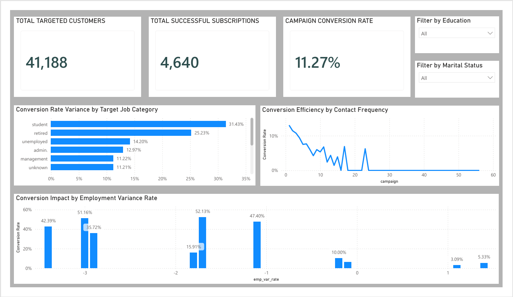

# Bank Marketing Analytics Dashboard 📊

## Project Overview
This project analyzes the results of a bank's telemarketing campaign for a term deposit product. The primary objective was to identify high-converting customer demographics and determine the optimal number of contact attempts before conversion rates diminish, allowing the sales team to optimize resource allocation.

## Architecture & Tools Used
* **Data Processing:** Python (Pandas, Jupyter Notebook for data cleaning, handling missing values, and exploratory data analysis)
* **Database Management:** PostgreSQL (Data extraction, schema design, and query optimization)
* **Business Intelligence:** Power BI (DAX explicit measures, Data Modeling, UI/UX Dashboard Layout, and Interactive Filtering)

## Key Business Insights 💡
1. **The "Drop-Off" Point:** The conversion rate is highest on the initial contact but completely collapses after the 5th or 6th contact attempt. 
   * *Recommendation: Cap campaign outreach at 5 attempts per customer to prevent wasted resources and customer fatigue.*
2. **Top Performing Demographics:** Students and retired individuals convert at significantly higher rates (above 25%) compared to blue-collar workers (6.8%).
3. **Macro-Economic Impact:** Customers demonstrate a notably higher likelihood to subscribe to the term deposit when the employment variance rate is negative, indicating a shift toward secure financial behavior during struggling economic periods. 

## Dashboard Preview

## How to Use This Repository
* **Python Analysis:** Open `campaign_analysis.ipynb` to view the initial data cleaning and exploratory data analysis steps.
* **Interactive Dashboard:** Download the `Customer_Campaign_Analytics_Dashboard.pbix` file and open it in Power BI Desktop to interact with the full dynamic dashboard and explore the DAX measures.
